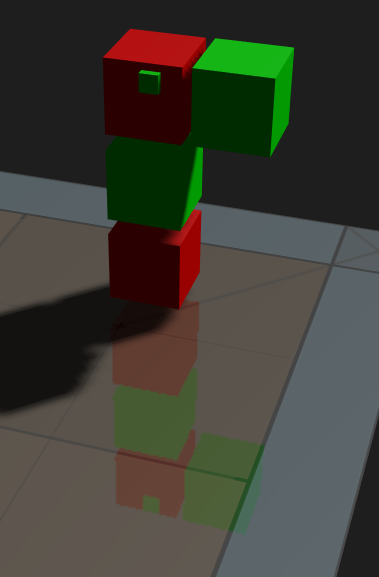
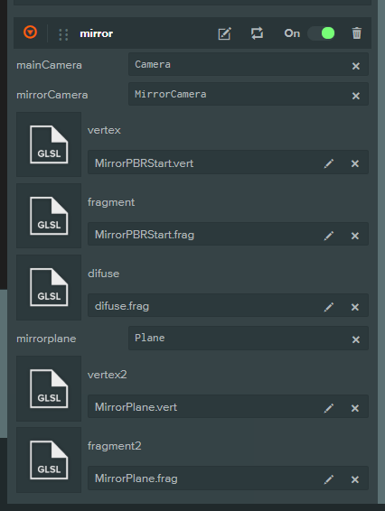

# Mirror Shader

实现镜面效果




工程：https://playcanvas.com/editor/scene/854090

原理与Unity的基本相同。

## 工程配置
依赖Mirror.js相关脚本 与Shader




## Shader的写法

参考MirrorPlane.frag /vert 写法

其中一定要使用`#version 300 es` 

片段着色器中要写一个输出`out vec4 fragColor;`

这里一定要有别于Chunks的写法，如果使用的PBR材质还是要以Chunks为基础的。


## 实现过程

正常Unity的中是通过替换camera 的 `viewMatrix `(palycanvas) 即 `worldToCameraMatrix`(unity)

Unity实现：

```csharp
reflectionCamera.worldToCameraMatrix = cam.worldToCameraMatrix * reflection;

```


但在PlayCanvs中找到相关的如下方法，但未起作用
```js
    this.mirrorCamera.camera.calculateTransform = function(proj){
         proj = curViewMat.invert();
         //return proj;  
    };
```

可以参考如下的源码内容，只是对Frustum进行更新，其 `viewMatrix `未变化。
```js
  }, updateCameraFrustum:function(camera) {
    if (camera.vrDisplay && camera.vrDisplay.presenting) {
      projMat = camera.vrDisplay.combinedProj;
      var parent = camera._node.parent;
      if (parent) {
        viewMat.copy(parent.getWorldTransform()).mul(camera.vrDisplay.combinedViewInv).invert();
      } else {
        viewMat.copy(camera.vrDisplay.combinedView);
      }
      viewInvMat.copy(viewMat).invert();
      this.viewInvId.setValue(viewInvMat.data);
      camera.frustum.update(projMat, viewMat);
      return;
    }
    projMat = camera.getProjectionMatrix();
    if (camera.overrideCalculateProjection) {
      camera.calculateProjection(projMat, pc.VIEW_CENTER);
    }
    if (camera.overrideCalculateTransform) {
      camera.calculateTransform(viewInvMat, pc.VIEW_CENTER);
    } else {
      var pos = camera._node.getPosition();
      var rot = camera._node.getRotation();
      viewInvMat.setTRS(pos, rot, pc.Vec3.ONE);
      this.viewInvId.setValue(viewInvMat.data);
    }
    viewMat.copy(viewInvMat).invert();
    camera.frustum.update(projMat, viewMat);
```

如下代码可以用于理解`viewMatrix `如何生成的，其就是以Tranform的进行变换，注意有一次求反的过程。
```js
getViewMatrix:function() {
    if (this._viewMatDirty) {
      var wtm = this._node.getWorldTransform();
      this._viewMat.copy(wtm).invert();
      this._viewMatDirty = false;
    }
    return this._viewMat;
  }
```

所以在还是使用的基于先对Tranform进行变换。先变换其Normal以及forward，再使用Lookat方法获取其新的transform。这样其`viewMatrix `也会自动进行更新。

```js
     var pivotPos = this.mainCamera.script.orbitCamera.pivotPoint;
    
     var  reflectPivotPos = reflectionMat.transformPoint(pivotPos);
    
     var curUp = reflectionMat.transformVector(this.mainCamera.up.clone());
    this.mirrorCamera.lookAt(reflectPivotPos, curUp);
```

另外注意，`projectionMatrix` 两个引擎都有这个属性，其值也只是projection变换，不是MVP相乘之后的结果。