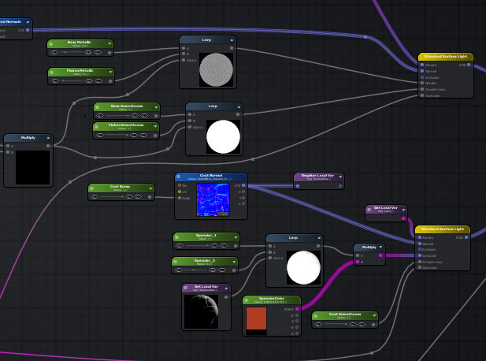

# High Car

主要目的是为了制作高渲染效果的车车漆Shader，和镜面的效果。

## 车漆


### Shader扩展框架

引擎使用chunks用于管理Shader，如下目录定义各种功能的Shader片段，其并不是完整的Shader代码，通过配置把这些片段组合成完整的shader。


引擎支持基于自定义chunks替换 Material的chunks，来实现自定义的Shader。

```js
    var mychunks = {};    
    mychunks.startVS = this.startVert.resource;       
    mychunks.diffusePS = this.difuse.resource;     
    mychunks.startPS = this.fragment.resource;    

    //"\nvoid main(void) {\n dDiffuseLight = vec3(0);\n dSpecularLight = vec3(0);\n dReflection = vec4(0);\n dSpecularity = vec3(0);\n";
    mychunks.extensionVS = "\n \n";

    //update my chunks
    curM.chunks = mychunks;
```

这里为提升Shader的制作效率，以上的Chunks机制与Unity的中的一些可视化Shader工具的各种功能结点很相似，以至为启发构建一个框架。
基本的思路是基于Unity的AmplifyShaderEditor的插件进行Shader的可视化制作 ，在PlayerCanvas构建一套Chunks，与AmplifyShaderEditor的各功能结点相匹配。



如下面的代码，定义了两个结点，

- unpackNormal 
用于解析法线贴图，读取法线向量
```js
vec3 zunpackNormal(vec4 nmap) {
    vec3 normal;
    normal.xy = nmap.wy * 2.0 - 1.0;
    normal.z = sqrt(1.0 - saturate(dot(normal.xy, normal.xy)));
    return normal;
}
```
- fresnel
根据世界法线向量，用于计算菲捏尔值
```js
float fresnel(vec3 worldViewDir, vec3 worldNormal)
{
    float fresnel = _FresnelScale + (1.0 - _FresnelScale) * pow(1.0 - dot(worldViewDir, worldNormal), _FresnelRange);
    //float fresnel = pow(1.0 - dot(worldViewDir, worldNormal), 2.0);
    return saturate(fresnel);
}
```

Shader输出节点映射


标准PBR 材质的标准输出通道

基本与PlayCanvas中找到对应的定义


### 车漆原理


在车身钢板之上，有电泳层、中涂层、色漆层和清漆层四个漆层组成，这四个漆层共同构成了我们目视所得的车漆层，如果你车要是被刮花了得补，修补的车漆仅相当于部分中涂层+色漆层+清漆层。每一个漆层的作用大致如下：

- 电泳层：直接附着在白车身上，对车身有防腐保护，并为中涂层提供良好的附着环境。
- 中涂层：附着在电泳层上，防紫外线，保护电泳层，并加强车身的防腐保护，为色漆层提供良好的附着环境，部分厂商的中涂层也能对色漆的色相起一定的衬托作用。
- 色漆层：附着在中涂层，进一步加强车身的防腐保护，并展示色相，我们看到的各种颜色就是色漆层展示出来的。
- 清漆层：附着在色漆层，更一步加强车身的防腐保护，并保护色漆层不受微小的刮擦，使颜色更透亮，减缓褪色现象。

那么车漆大致分为几种效果呢，简单分类如下：


- 普通漆（素色漆）：合成材质包括树脂、颜料和添加剂。最常见的颜色有白色、大红色和黄色。一般便宜的五菱宏光这些都是采用这类漆，色彩很纯，没有其他的层次感。车漆和PBR（基于物理渲染）技术
- 金属漆：在素色漆中加有细微金属粒子的一种涂料，还能增加车漆硬度，是目前流行的一种车漆。最常见的是加有微细的铝粉，光线射到铝粒上后，又被铝粒透过漆膜反射出来，亮晶晶的。车漆和PBR（基于物理渲染）技术
- 珠光漆：加入了云母粒，于是他的反光的方向性导致了色彩斑斓的视觉效果。它的抗氧化能力强，一般多出现在高端车型上。但是珠光漆修补比较麻烦，费用也相对较高一些。车漆和PBR（基于物理渲染）技术

参考如下：
https://www.element3ds.com/forum.php?mod=viewthread&tid=154746&_dsign=2f135e68


### 车漆实现

方案一：双层高光融合金属车漆
AmplifyShaderEditor 节点图如下：


区域节点说明：
菲捏尔边缘高光处理
高光融合着色层
金属漆粒子层
PBR光滑度处理
AO强度控制

Unity实现效果


方案二：亚光MatCap金属车漆

AmplifyShaderEditor 节点图如下：


区域节点说明：
MatCap 模拟PBR着色
金属漆粒子层
菲捏尔边缘高光处理

MatCap原理：
https://www.element3ds.com/forum.php?mod=viewthread&tid=190600&_dsign=e52191c8


微元素中的位置：
微库›技术|流程›节点材质›MatCap球

PlayCanvas实现效果


### 顶点切线
目前的主要问题是
顶点的切线坐标无法获取到vertex_tangent
通过在3D Max里加入顶点切线信息，playcanvas也无法读取。

目前Playcanvas只支持对一些预制的模型支持自动生成顶点切线信息。比如Box等。
相关代码在


```js
    // optimized pc.calculateTangents for many calls with different index buffer but same vertex buffer
    _calculateTangentsMorphTarget: function (positions, normals, uvs, indices,
        tan1, tan2, mtIndices, tangents) {
        var sdirx, sdiry, sdirz;
        var tdirx, tdiry, tdirz;
        var v1x, v1y, v1z;
        var v2x, v2y, v2z;
        var v3x, v3y, v3z;
        var w1x, w1y;
        var w2x, w2y;
        var w3x, w3y;
        var t1x, t1y, t1z;
        var t2x, t2y, t2z;
        var nx, ny, nz;

```

Unity是在加载过程中进行生成的。


有关Mikktspace的标准 计算切线空间贴图
http://www.ufgame.com/mikktspace.html

有C版本的代码，正在进行JS的编码开发
https://github.com/teared/mikktspace-for-houdini/tree/master/source


## 工程：


